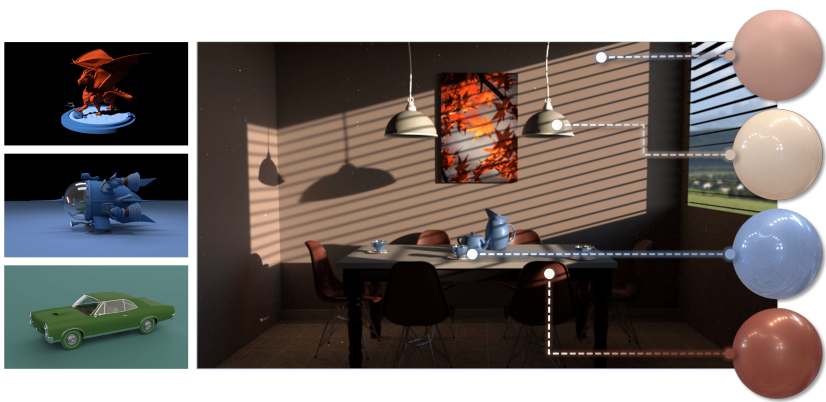
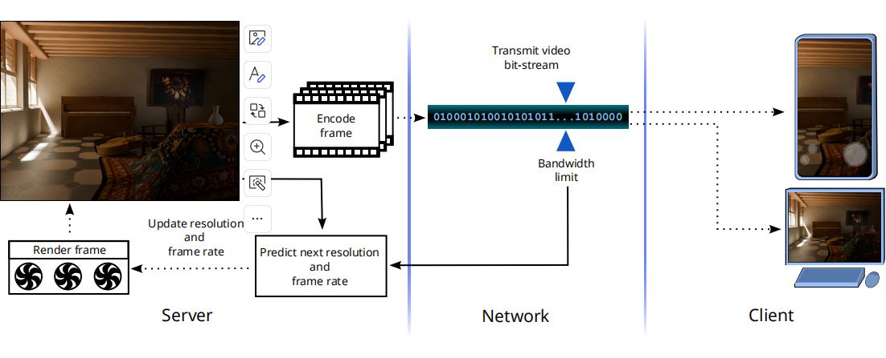
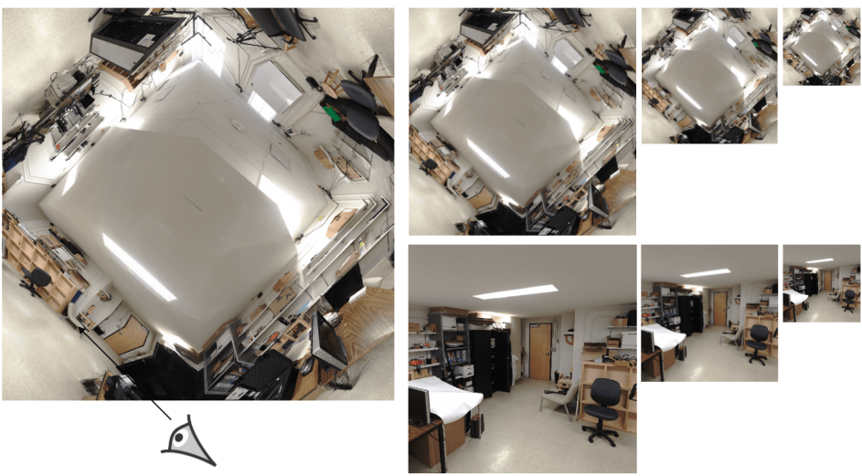

<!-- ---
permalink: /cv/
title: "CV"
---

Tempor velit sint sunt ipsum tempor enim ad qui ullamco. Est dolore anim ad velit duis dolore minim sunt aliquip amet commodo labore. Ut eu pariatur aute ea aute excepteur laborum. Esse ea esse excepteur minim mollit qui cillum excepteur ex dolore magna. Labore deserunt fugiat incididunt incididunt sint ea. Consequat dolore aute laboris quis proident quis non et est consectetur ex eiusmod sit culpa.

Cupidatat ea do et in excepteur in. Ad nostrud ut est esse eu duis ea sunt eiusmod. Aliquip tempor veniam sint elit fugiat. Velit incididunt laboris amet incididunt labore dolore irure velit excepteur commodo deserunt laborum. Consectetur eu fugiat veniam veniam Lorem labore magna eiusmod. Ea occaecat reprehenderit pariatur consectetur minim labore ut aliquip.
 -->
<!-- "Aren't the pleasures of the affections greater than the pleasures of the senses? And aren't the pleasures of the intellect greater than the pleasures of the affections?" -->

<!-- Update:

I will probably join University of Cambridge for CS PhD this coming October! Shoot me a message if you want to chat about academics, startup, vc, fashion etc.  -->

## About me

I’m a second year PhD student in the Department of CST at University of Cambridge, advised by Prof. [Rafal Mantiuk](https://www.cl.cam.ac.uk/~rkm38/). My current research interest lies in the intersection field of **Computer Graphics** and **Machine Learning**. My research background includes content adaptive rendering and real-time 3D Reconstruction.

Previously, I obtained my B.Sc. degree in **pure math** at University of Toronto, and Msc. degree in **computer engineering** at McGill University, where I was gratefully supervised by [Prof. Derek Nowrouzezahrai](https://www.cim.mcgill.ca/~derek/) and [Prof. Morgan McGuire](https://casual-effects.com/morgan/index.html).

Beyond research, I enjoy reading, fashion, and the arts. I'm particularly interested in psychoanalysis as well as both Eastern and Western philosophy.

Feel free to reach out via email if you're interested in research collaboration❤️
<!-- life philosphy greatly influenced by I Ching, Plato and Francis Bacon; chilhood's fav is L'Étoile by Edgar Degas but fascinated by Piet Mondrian and Jack Pollock's work these days. -->

## News
[June, 2025] I'm glad to be selected as a finalist for the [Qualcomm Innovation Fellowship Europe 2025](https://www.qualcomm.com/research/university-relations/innovation-fellowship)!

[March, 2025] I'm honored to receive the [Rabin Ezra Scholarship Trust](https://sites.google.com/view/rabin-ezra-scholarship-trust) 2025 Award!
<!-- Graduate Excellence Awards, McGill University 2021-2023 -->

<!-- ## Research
### 1. NeuMaDiff: Neural Material Synthesis via Hyperdiffusion
   
Chenliang Zhou, Zheyuan Hu, Alejandro Sztrajman, Yancheng Cai, Yaru Liu, Cengiz Oztireli -->

## Research
<!-- 
### Streaming of rendered content with adaptive frame rate and resolution
**Yaru Liu**, Joseph March, Rafal Mantiuk

    -->

### [NeuMaDiff: Neural Material Synthesis via Hyperdiffusion](https://arxiv.org/abs/2411.12015)
<!-- Chenliang Zhou, Zheyuan Hu, Alejandro Sztrajman, Yancheng Cai, Yaru Liu, Cengiz Oztireli   
Submitted to ICCV 2025  -->
Chenliang Zhou, Zheyuan Hu, Alejandro Sztrajman, Yancheng Cai, **Yaru Liu**, Cengiz Oztireli, Submitted to ICCV 2025

  

<!-- NeuMaDiff is a novel **neural material synthesis framework** utilizing **hyperdiffusion**. The method employs **neural fields** as a low-dimensional representation and incorporates a **multi-modal conditional hyperdiffusion model** to learn the distribution over material weights.  
This enables **flexible guidance** through inputs such as **material type, text descriptions, or reference images**, providing greater control over material synthesis. -->

NeuMaDiff is a novel neural material synthesis framework utilizing hyperdiffusion. The method employs
neural fields as a low-dimensional representation and incorporates a multi-modal conditional hyperdiffusion model
to learn the distribution over material weights. This enables
flexible guidance through inputs such as material type, text
descriptions, or reference images, providing greater control
over synthesis. 

---

### [Real-Time Scene Reconstruction using Light Field Probes](https://arxiv.org/abs/2507.14624)
**Yaru Liu**, Derek Nowrouzezahrai, Morgan McGuire, I3D 2024, Poster

   

Our research explores novel view synthesis methods that reconstruct complex scenes without relying on explicit geometry data. Our approach leverages sparse real-world images to generate multi-scale implicit representations of scene geometries.
A key innovation is our probe data structure, which captures highly accurate depth information from dense data points. This allows us to reconstruct detailed scenes at a lower computational cost, making rendering performance independent of scene complexity. Additionally, compressing and streaming probe data is more efficient than handling explicit scene geometry, making our method ideal for large-scale rendering applications.

## Talks
[Streaming of rendered content with adaptive frame rate and resolution](https://www.cst.cam.ac.uk/seminars/list/232780), University of Cambridge, May 2025

<!-- studying Computer Engineering. In parallel, I’ve been working as a research assistant at the McGill Graphics Lab (MGL), advised by Prof. Derek Nowrouzezahrai.

I am currently working on the neural representations of 3D scenes and am grateful to be supervised by Prof. Derek Nowrouzezahrai and Prof. Morgan Mcguire. I’m also broadly interested in computer vision and machine learning, and other topics about computer graphics, e.g. rendering, virtual reality, and augmented reality 

Previously, I specialized in mathematics (75% theoretical math, 25% applied math), and minor in computer science at University of Toronto. Before returning to master, I spent some time in the industry, cofounding Willow, Canada's first real estate investing platform, and worked at HSBC Bank Canada.

Other than my research work, I love reading, fashion and arts. Psychoanalysis, eastern and western philosophy have been my favorite subjects; life philosphy greatly influenced by I Ching, Plato and Francis Bacon; chilhood's fav is L'Étoile by Edgar Degas but fascinated by Piet Mondrian and Barnett Newman's work these days.
However, research work is my passion, and rest of them are hobbies.
 -->
