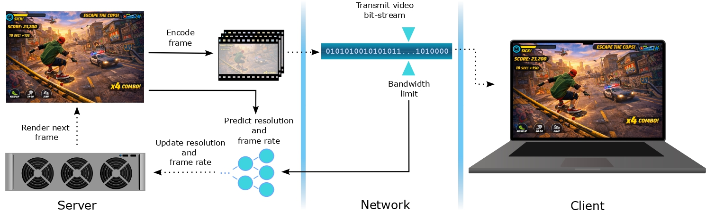
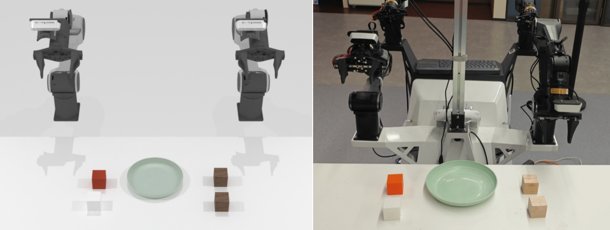
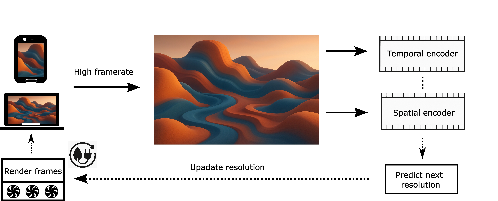
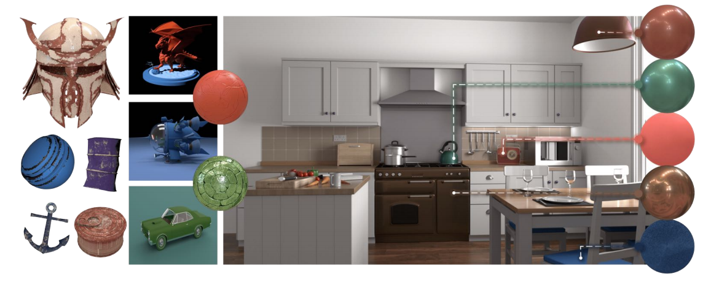

<!-- "Aren't the pleasures of the affections greater than the pleasures of the senses? And aren't the pleasures of the intellect greater than the pleasures of the affections?" -->

 

  <!-- Left Column: Profile Picture -->
  

    
    

      <a href="https://scholar.google.co.uk/citations?view_op=list_works&hl=en&user=F5qFAhUAAAAJ">Google Scholar</a> 
      <a href="https://www.linkedin.com/in/yaru-liu-aa5288bb/">LinkedIn</a> &nbsp;|&nbsp;
      <a href="https://github.com/yarusophialiu">GitHub</a> &nbsp;|&nbsp;
      <a href="mailto:yl962@cam.ac.uk">Email</a>
    

  

  
  <!-- Right Column: Title and Bio text -->
  

<h1 style="text-align: center; border-bottom: none; margin: 0 0 15px 0;">Yaru Liu</h1>

Hi there! I’m a third year PhD student in the Department of CST at University of Cambridge, advised by Prof. [Rafal Mantiuk](https://www.cl.cam.ac.uk/~rkm38/). My PhD research lies in the intersection field of **Computer Graphics** and **Machine Learning**. My research background includes content adaptive rendering and real-time 3D Reconstruction.

Previously, I obtained my B.Sc. degree in **pure math** at University of Toronto, and Msc. degree in **computer engineering** at McGill University, where I was gratefully supervised by [Prof. Derek Nowrouzezahrai](https://www.cim.mcgill.ca/~derek/) and [Prof. Morgan McGuire](https://casual-effects.com/morgan/index.html).

Beyond research, I love business and fashion. I've created 3 startups with 1 exit, and am super interested in things with high technical barriers. I am driven by applicable questions, and sometimes use business to anchor my academic pursuits. Beyond that, fashion serves as my creative therapy. To me, these three don't just coexist — they complement and elevate one another.

Feel free to reach out for collaboration🩵
  

## News

- **[Apr, 2026]** Our paper, **"Streaming of Rendered Content with Adaptive Frame Rate and Resolution,"** has been accepted to **SIGGRAPH 2026**.
- **[Jan, 2026]** Started my internship at the **NVIDIA Real-Time Graphics Group**.
- **[Jun, 2025]** Honored to be selected as a finalist for the [Qualcomm Innovation Fellowship Europe 2025](https://www.qualcomm.com/research/university-relations/innovation-fellowship).
- **[May, 2025]** Invited Talk: [Streaming of rendered content with adaptive frame rate and resolution](https://www.cst.cam.ac.uk/seminars/list/232780) at the **University of Cambridge**.
- **[Mar, 2025]** Grateful to receive the [Rabin Ezra Scholarship Trust](https://sites.google.com/view/rabin-ezra-scholarship-trust) 2025 Award.

## Projects

<table style="width:100%;border:0px;border-spacing:0px;border-collapse:separate;margin-right:auto;margin-left:auto;">
  
  <!-- Streaming of rendered content -->
  <tr>
    <td style="padding:20px;width:35%;vertical-align:middle; text-align: center;">
      
    </td>
    <td style="padding:20px;width:65%;vertical-align:middle">
      <a href="">
        Streaming of rendered content with adaptive frame rate and resolution
      </a>
       
      <strong>Yaru Liu</strong>, Joseph March, Rafal Mantiuk
       
      <em>Accepted to SIGGRAPH 2026</em>
       
      <a href="">[Paper]</a>
      
We exploit the spatio-temporal limits of the human visual system to adaptively adjust frame rate and resolution based on scene content and motion. A lightweight neural network predicts the optimal configuration to maximize perceptual quality while minimizing rendering load under bandwidth constraints.

    </td>
  </tr>

  <!-- V-CAGE -->
  <tr>
    <td style="padding:20px;width:35%;vertical-align:middle;text-align:center;">
      
    </td>
    <td style="padding:20px;width:65%;vertical-align:middle">
      V-CAGE: Vision-Closed-Loop Agentic Generation Engine for Robotic Manipulation
       
      <strong>Yaru Liu</strong>, Ao-bo Wang, Nanyang Ye
       
      
We present V-CAGE, an agentic framework for autonomous robotic data synthesis that leverages foundation models to bridge high-level semantic reasoning with low-level physical interaction. By centralizing semantic layout planning and visual self-verification, V-CAGE fully automates the end-to-end pipeline for highly scalable robotic datasets.

    </td>
  </tr>

  <!-- Seeing enough -->
  <tr>
    <td style="padding:20px;width:35%;vertical-align:middle;text-align:center;">
      
    </td>
    <td style="padding:20px;width:65%;vertical-align:middle">
      <a href="https://arxiv.org/abs/2604.07959">
        Seeing enough: non-reference perceptual resolution selection for power-efficient client-side rendering
      </a>
       
      <strong>Yaru Liu</strong>, Dayllon Vinícius Xavier Lemos, Ali Bozorgian, Chengxi Zeng, Alexander Hepburn, Arnau Raventos
       
      <a href="https://arxiv.org/abs/2604.07959">[Paper]</a>
      
We propose a non-reference method leveraging the spatio-temporal limits of human vision to predict the lowest resolution that remains perceptually indistinguishable from maximum quality. This enables highly efficient, perception-guided client-side rendering on power-constrained devices.

    </td>
  </tr>

  <!-- M3ashy -->
  <tr>
    <td style="padding:20px;width:35%;vertical-align:middle;text-align:center;">
      
    </td>
    <td style="padding:20px;width:65%;vertical-align:middle">
      <a href="https://ojs.aaai.org/index.php/AAAI/article/view/38363">
        M3ashy: Multi-modal material synthesis via hyperdiffusion
      </a>
       
      Chenliang Zhou, Zheyuan Hu, Alejandro Sztrajman, Yancheng Cai, <strong>Yaru Liu</strong>, Cengiz Oztireli
       
      <em>Proceedings of the AAAI Conference on Artificial Intelligence</em>
       
      <a href="https://ojs.aaai.org/index.php/AAAI/article/view/38363">[Paper]</a>
      
This framework enables neural material synthesis utilizing hyperdiffusion to learn the distribution over material weights. It provides flexible generation guided by multi-modal inputs such as material types, text descriptions, or reference images.

    </td>
  </tr>

  <!-- Real-Time Scene Reconstruction -->
  <tr>
    <td style="padding:20px;width:35%;vertical-align:middle;text-align:center;">
      
    </td>
    <td style="padding:20px;width:65%;vertical-align:middle">
      <a href="https://arxiv.org/abs/2507.14624">
        Real-Time Scene Reconstruction using Light Field Probes
      </a>
       
      <strong>Yaru Liu</strong>, Derek Nowrouzezahrai, Morgan McGuire
       
      <em>I3D 2024, Poster</em>
       
      <a href="https://arxiv.org/abs/2507.14624">[Paper]</a>
      
Our approach leverages sparse real-world images to generate multi-scale implicit representations of scene geometries. By introducing a novel probe data structure, we accurately capture depths to decouple rendering performance from scene complexity.

    </td>
  </tr>
</table>