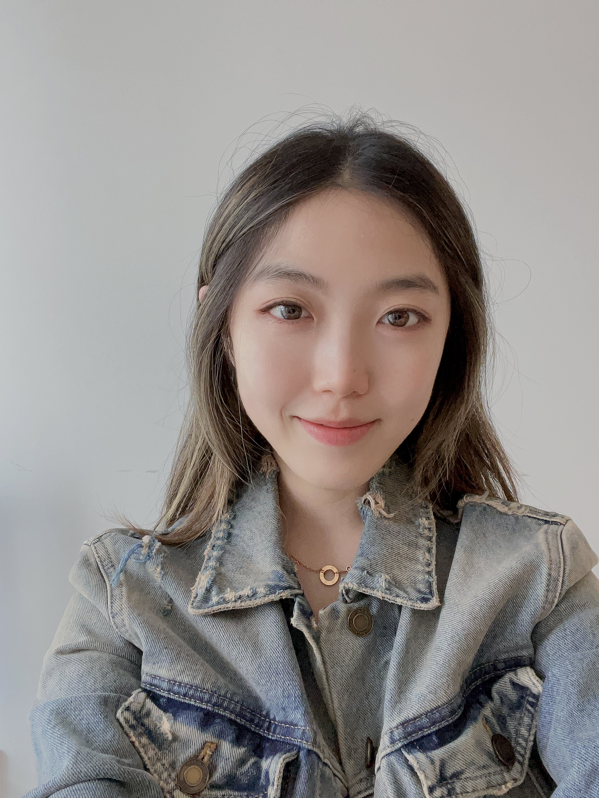
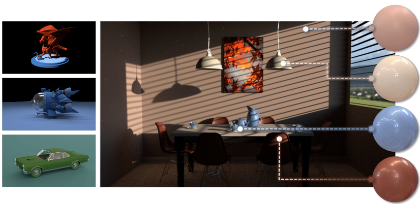
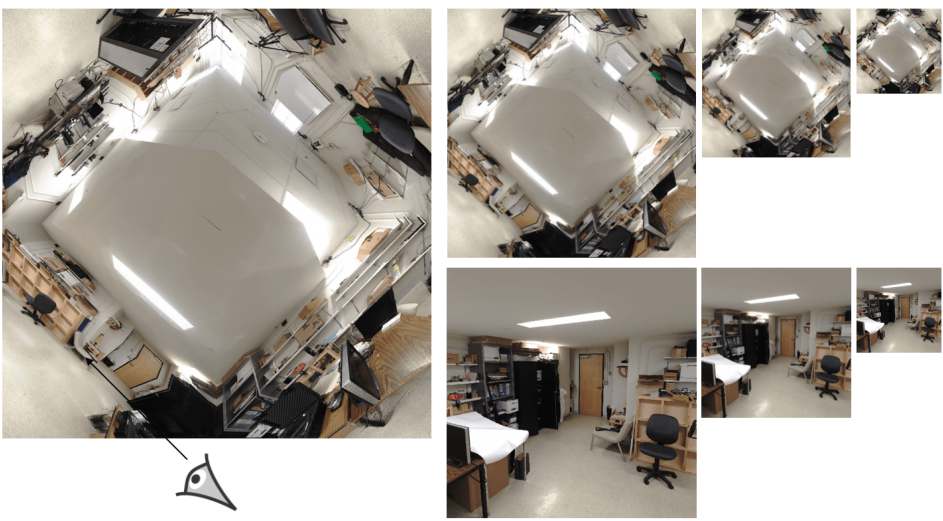

<!-- "Aren't the pleasures of the affections greater than the pleasures of the senses? And aren't the pleasures of the intellect greater than the pleasures of the affections?" -->

 

# Yaru Liu

Hi there! I’m a third year PhD student in the Department of CST at University of Cambridge, advised by Prof. [Rafal Mantiuk](https://www.cl.cam.ac.uk/~rkm38/). My current research interest lies in the intersection field of **Computer Graphics** and **Machine Learning**. My research background includes content adaptive rendering and real-time 3D Reconstruction.

Previously, I obtained my B.Sc. degree in **pure math** at University of Toronto, and Msc. degree in **computer engineering** at McGill University, where I was gratefully supervised by [Prof. Derek Nowrouzezahrai](https://www.cim.mcgill.ca/~derek/) and [Prof. Morgan McGuire](https://casual-effects.com/morgan/index.html).

Beyond research, I love business and fashion. I've created 3 startups with 1 exit, and am super interested in startups with higher technical barriers. I am driven by applicable questions, and sometimes use business to anchor my academic pursuits. Beyond that, fashion serves as my creative therapy, which I fell in love with since I was in grade 3. To me, these three don't just coexist—they complement and elevate one another.

Feel free to reach out for collaboration❤️

## News

- **[Apr, 2026]** Our paper, **"Streaming of Rendered Content with Adaptive Frame Rate and Resolution,"** has been accepted to **SIGGRAPH 2026**.
- **[Jan, 2026]** Started my internship at the **NVIDIA Real-Time Graphics Group**.
- **[Jun, 2025]** Honored to be selected as a finalist for the [Qualcomm Innovation Fellowship Europe 2025](https://www.qualcomm.com/research/university-relations/innovation-fellowship).
- **[May, 2025]** Invited Talk: [Streaming of rendered content with adaptive frame rate and resolution](https://www.cst.cam.ac.uk/seminars/list/232780) at the **University of Cambridge**.
- **[Mar, 2025]** Grateful to receive the [Rabin Ezra Scholarship Trust](https://sites.google.com/view/rabin-ezra-scholarship-trust) 2025 Award.

## Publications

### [NeuMaDiff: Neural Material Synthesis via Hyperdiffusion](https://arxiv.org/abs/2411.12015)
Chenliang Zhou, Zheyuan Hu, Alejandro Sztrajman, Yancheng Cai, **Yaru Liu**, Cengiz Oztireli 
*Submitted to ICCV 2025* 
[[Paper]](https://arxiv.org/abs/2411.12015)

  

NeuMaDiff is a novel neural material synthesis framework utilizing hyperdiffusion. The method employs
neural fields as a low-dimensional representation and incorporates a multi-modal conditional hyperdiffusion model
to learn the distribution over material weights. This enables
flexible guidance through inputs such as material type, text
descriptions, or reference images, providing greater control
over synthesis. 

---

### [Real-Time Scene Reconstruction using Light Field Probes](https://arxiv.org/abs/2507.14624)
**Yaru Liu**, Derek Nowrouzezahrai, Morgan McGuire 
*I3D 2024, Poster* 
[[Paper]](https://arxiv.org/abs/2507.14624)

   

Our research explores novel view synthesis methods that reconstruct complex scenes without relying on explicit geometry data. Our approach leverages sparse real-world images to generate multi-scale implicit representations of scene geometries.
A key innovation is our probe data structure, which captures highly accurate depth information from dense data points. This allows us to reconstruct detailed scenes at a lower computational cost, making rendering performance independent of scene complexity. Additionally, compressing and streaming probe data is more efficient than handling explicit scene geometry, making our method ideal for large-scale rendering applications.
