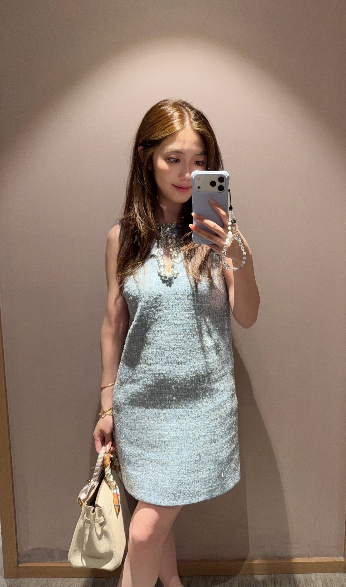
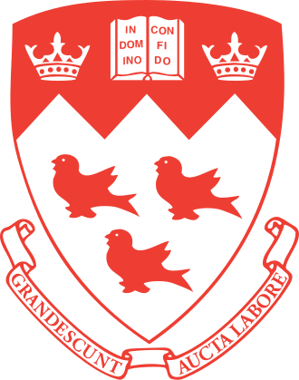
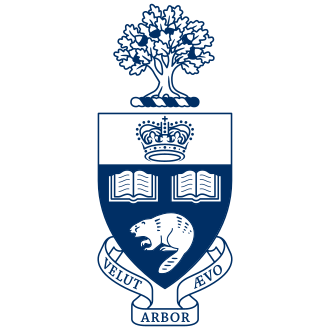
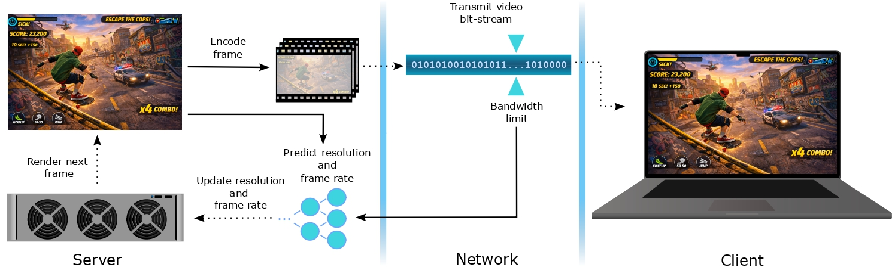
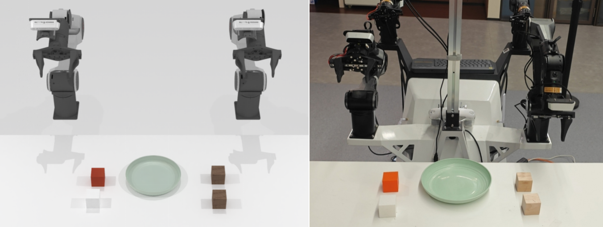
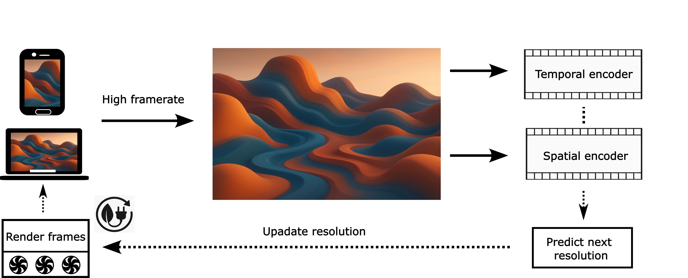
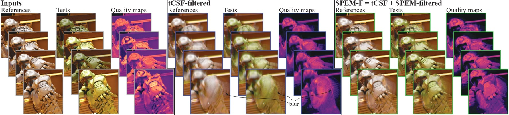
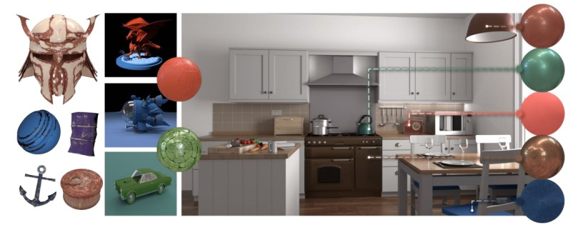
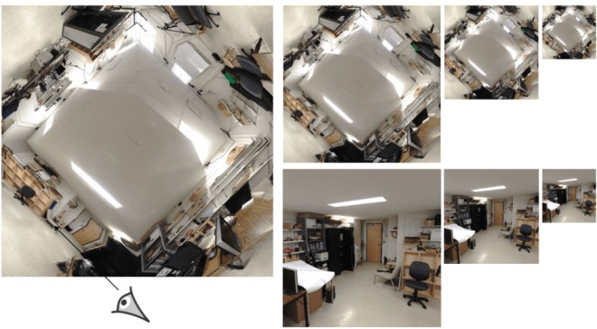

<!-- "Aren't the pleasures of the affections greater than the pleasures of the senses? And aren't the pleasures of the intellect greater than the pleasures of the affections?" -->

 

  <!-- Left Column: Profile Picture -->
  

    
    

      <a href="https://scholar.google.co.uk/citations?view_op=list_works&hl=en&user=F5qFAhUAAAAJ">Google Scholar</a> 
      <a href="https://www.linkedin.com/in/yaru-liu-aa5288bb/">LinkedIn</a> &nbsp;|&nbsp;
      <a href="https://github.com/yarusophialiu">GitHub</a> &nbsp;|&nbsp;
      <a href="mailto:yl962@cam.ac.uk">Email</a>
    

  

  
  <!-- Right Column: Title and Bio text -->
  

<h1 style="text-align: center; border-bottom: none; margin: 0 0 15px 0;">Yaru Liu</h1>

<!-- Hi there! I’m a third year PhD student in the Department of CST at University of Cambridge, advised by Prof. [Rafal Mantiuk](https://www.cl.cam.ac.uk/~rkm38/). My PhD research lies in the intersection field of **Computer Graphics** and **Machine Learning**. My research background includes content adaptive rendering and real-time 3D Reconstruction. I care about **world models** and **embodied AI safety**. -->

Hi there! I'm a third-year PhD student in the Department of Computer Science and Technology at the University of Cambridge, advised by Prof. [Rafal Mantiuk](https://www.cl.cam.ac.uk/~rkm38/). My research sits at the intersection of **Computer Graphics** and **Machine Learning**, with a background in content-adaptive rendering and real-time 3D reconstruction. I care about **world models** and **embodied AI safety**.

Previously, I earned a B.Sc. in **pure math** at the University of Toronto and an M.Sc. in **computer engineering** at McGill University. I'm just an ordinary person who has been incredibly lucky to meet so many great people along the way. I'm deeply grateful for the guidance and trust of my PhD advisor [Prof. Rafal Mantiuk](https://www.cl.cam.ac.uk/~rkm38/), [Prof. Derek Nowrouzezahrai](https://www.cim.mcgill.ca/~derek/) and [Prof. Morgan McGuire](https://casual-effects.com/morgan/index.html) at McGill, and my supervisors at Tencent, NVIDIA and Huawei.

Beyond research, I love business and fashion. I've founded 3 startups, 1 of which was acquired, and I'm drawn to problems with high technical barriers. I'm driven by practical questions, and business often anchors my academic pursuits, while fashion is my creative therapy. To me, research, business and fashion don't just coexist. They complement and elevate one another.

Feel free to reach out for collaboration🩵
  

## News

- **[Jun, 2026]** Joined the **Tencent Qingyun Plan (腾讯青云计划)** to work on **world models**.
- **[Apr, 2026]** Our paper, [**"Streaming of Rendered Content with Adaptive Frame Rate and Resolution,"**](https://www.cl.cam.ac.uk/research/rainbow/projects/adaptive_streaming/) has been accepted to **SIGGRAPH 2026**.
- **[Jan, 2026]** Started my internship at the **NVIDIA Real-Time Graphics Group**.
- **[Jun, 2025]** Honored to be selected as a finalist for the [Qualcomm Innovation Fellowship Europe 2025](https://www.qualcomm.com/research/university-relations/innovation-fellowship).
<!-- - **[May, 2025]** Invited Talk: [Streaming of rendered content with adaptive frame rate and resolution](https://www.cst.cam.ac.uk/seminars/list/232780) at the **University of Cambridge**. -->
- **[Mar, 2025]** Grateful to receive the 2025 [Rabin Ezra Scholarship Trust](https://sites.google.com/view/rabin-ezra-scholarship-trust) as one of three UK researchers for excellence in computer graphics and visual computing.

## Education

University of Cambridge

Ph.D. in Computer Science

Supervised by Prof. <a href="https://www.cl.cam.ac.uk/~rkm38/">Rafal Mantiuk</a>

<em>Oct 2023 – Present (expecting 2027)</em>

McGill University

M.Sc. in Computer Engineering

Supervised by <a href="https://www.cim.mcgill.ca/~derek/">Prof. Derek Nowrouzezahrai</a> and <a href="https://casual-effects.com/morgan/index.html">Prof. Morgan McGuire</a>

<em>Sep 2021 – Aug 2023</em>

University of Toronto

B.Sc. in Theoretical Mathematics, Minor in Computer Science

<em>Sep 2015 – Oct 2019</em>

<h2 class="col-title">Research Experience</h2>

Tencent (Qingyun Plan)
 Research Intern, World Model · Shenzhen, China
 <em>Jun 2026 – Present</em>
<ul style="margin: 8px 0 0 0; padding-left: 18px; font-size: 0.9em;">
<!-- <li>Selected for Tencent's Qingyun Program, a highly selective talent initiative recruiting top-tier technical students for frontier AI research across Tencent's core labs.</li> -->
<li>Built a 3D reconstruction pipeline that ingests multiple generatively-produced videos and reconstructs coherent, geometrically consistent scenes.</li>
</ul>

NVIDIA
 Research Intern, Real-time Graphics Group · United Kingdom
 <em>Oct 2025 – Apr 2026</em>
<ul style="margin: 8px 0 0 0; padding-left: 18px; font-size: 0.9em;">
<li>Developed a universal motion-aware module, attachable to any video quality metric (VQM), that integrates physiologically plausible temporal filters to simulate human saccadic and smooth pursuit eye movements.</li>
<li>Enabled standard VQM benchmarks to accurately account for complex object trajectories and dynamic camera motion through human-visual-system (HVS)-inspired modeling.</li>
</ul>

Huawei R&amp;D UK
 Research Intern, AI Rendering Group · United Kingdom
 <em>Oct 2024 – Oct 2025</em>
<ul style="margin: 8px 0 0 0; padding-left: 18px; font-size: 0.9em;">
<li>Proposed a novel method to cut computational overhead by 50% on edge devices with zero degradation in visual fidelity.</li>
<li>3D Gaussian Splatting (3DGS) on edge devices.</li>
</ul>

<h2 class="col-title">Projects</h2>

Streaming of rendered content with adaptive frame rate and resolution
 
<strong>Yaru Liu</strong>, Joseph March, Rafal Mantiuk
 
<em>Accepted to SIGGRAPH 2026</em>
 
<a href="https://www.cl.cam.ac.uk/research/rainbow/projects/adaptive_streaming/">[Paper]</a>

We exploit the spatio-temporal limits of the human visual system to adaptively adjust frame rate and resolution based on scene content and motion. A lightweight neural network predicts the optimal configuration to maximize perceptual quality while minimizing rendering load under bandwidth constraints. Our approach successfully optimizes perceived quality while reducing 50%+ computational costs.

V-CAGE: Vision-Closed-Loop Agentic Generation Engine for Robotic Manipulation
 
<strong>Yaru Liu</strong>, Ao-bo Wang, Nanyang Ye, 2026
 
<a href="https://arxiv.org/abs/2604.09036">[Paper]</a>

We present V-CAGE, an agentic framework for autonomous robotic data synthesis that leverages foundation models to bridge high-level semantic reasoning with low-level physical interaction. By centralizing semantic layout planning and visual self-verification, V-CAGE fully automates the end-to-end pipeline for highly scalable robotic datasets.

Seeing enough: non-reference perceptual resolution selection for power-efficient client-side rendering
 
<strong>Yaru Liu</strong>, Dayllon Vinícius Xavier Lemos, Ali Bozorgian, Chengxi Zeng, Alexander Hepburn, Arnau Raventos, 2026
 
<a href="https://arxiv.org/abs/2604.07959">[Paper]</a>

We propose a non-reference method leveraging the spatio-temporal limits of human vision to predict the lowest resolution that remains perceptually indistinguishable from maximum quality. This enables highly efficient, perception-guided client-side rendering on power-constrained devices.

SPEM-F: Accounting for Eye Motion in Image and Video Quality Metrics
 
Pontus Ebelin, <strong>Yaru Liu</strong>, Niklas Sanden, Dounia Hammou, Daqi Lin, Tomas Akenine-Möller, Rafal Mantiuk, 2026
 

We present SPEM-F, a novel preprocessing filter that models smooth pursuit eye motion to convert any image or video metric into a perceptual video quality metric. Validated on a new 240-fps dataset, it physiologically simulates visual system latency, significantly improving prediction accuracy for temporal rendering artifacts and fast motion.

M3ashy: Multi-modal material synthesis via hyperdiffusion
 
Chenliang Zhou, Zheyuan Hu, Alejandro Sztrajman, Yancheng Cai, <strong>Yaru Liu</strong>, Cengiz Oztireli
 
<em>Proceedings of the AAAI Conference on Artificial Intelligence, 2025</em>
 
<a href="https://ojs.aaai.org/index.php/AAAI/article/view/38363">[Paper]</a>

This framework enables neural material synthesis utilizing hyperdiffusion to learn the distribution over material weights. It provides flexible generation guided by multi-modal inputs such as material types, text descriptions, or reference images.

Real-Time Scene Reconstruction using Light Field Probes
 
<strong>Yaru Liu</strong>, Derek Nowrouzezahrai, Morgan McGuire
 
<em>I3D 2024, Poster</em>
 
<a href="https://arxiv.org/abs/2507.14624">[Paper]</a>

Our approach leverages sparse real-world images to generate multi-scale implicit representations of scene geometries. By introducing a novel probe data structure, we accurately capture depths to decouple rendering performance from scene complexity.

## Hobby

Founded 3 startups (one acquired in 2023), consistently targeting problems with high technical barriers.

## Patent

**System and Method for Adaptive Rendering and Streaming** (2026 U.S. Patent Application)

- **Yaru Liu**, Joseph March, Rafal Mantiuk
- Optimized cloud-rendered content delivery using dynamic spatial-temporal scaling.

## Selected Award

- **Finalist**, Qualcomm Innovation Fellowship Europe 2025 — Jun 2025
- **Rabin Ezra Scholarship Trust** — Mar 2025
- **McGill University Graduate Excellence Awards** — 2021, 2022, 2023
